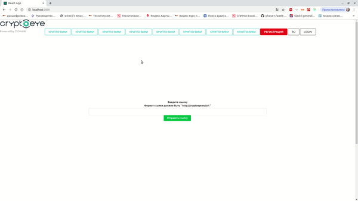

# Test
Фронт на порте 3000.
Преобразует ссылку ,которую ввёл пользователь в возвращает её.После нажатия на ссылку польователь перенаправляется на '/'.
Если произошла ошибка или ссылка неправильного формата-выскакивает сообщение об ошибке.

## Как запустить:
``cd back``

``npm i``

``npm start``

``cd ..``

``npm front``

``npm i ``

``npm start``

